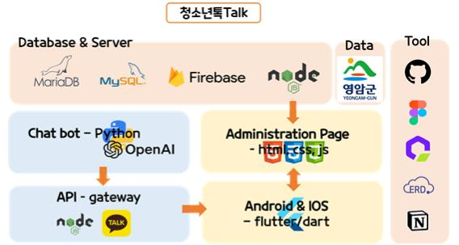
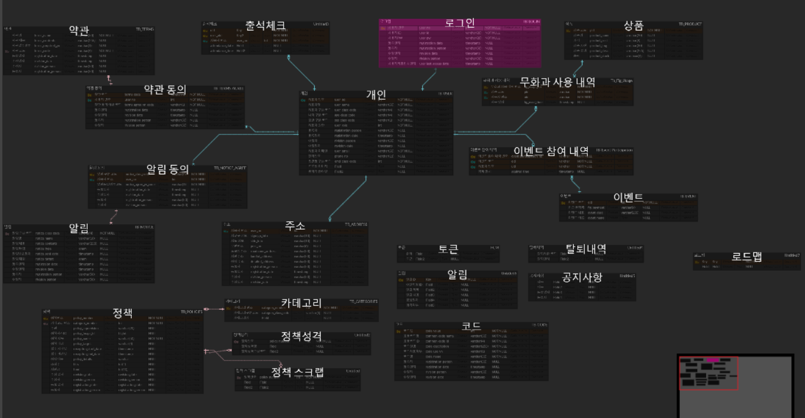

# Yeongam-project
나루의 영암군 프로젝트

## 모바일 화면

## 어드민 페이지

<table>
  <tr>
    <td style="text-align:center">로그인 화면</td>
    <td style="text-align:center">어드민 대시보드</td>
  </tr>
  <tr>
    <td></td>
    <td></td>
  </tr>
</table>

## 기술 스택

## ERD(개체 관계 다이어그램)

#### [벨류업 챗봇](https://github.com/Joonw00/Value_Up_Chatbot)
### 👀 팀 소개

* **Seoyun0626** - *Open AI 기반 Chat GPT 챗봇 개발* - [Seoyun0626](https://github.com/Seoyun0626)
